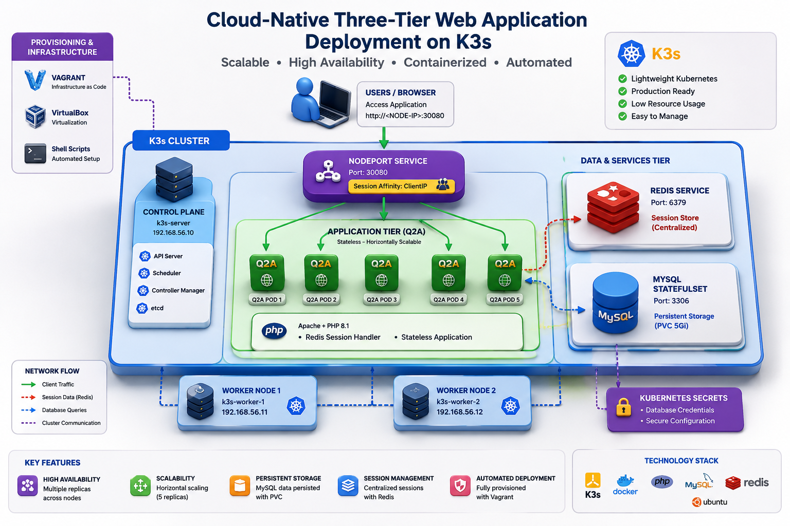
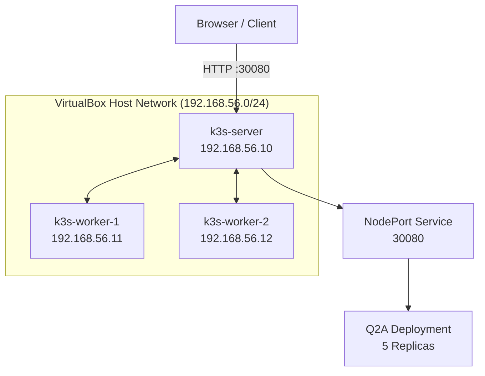
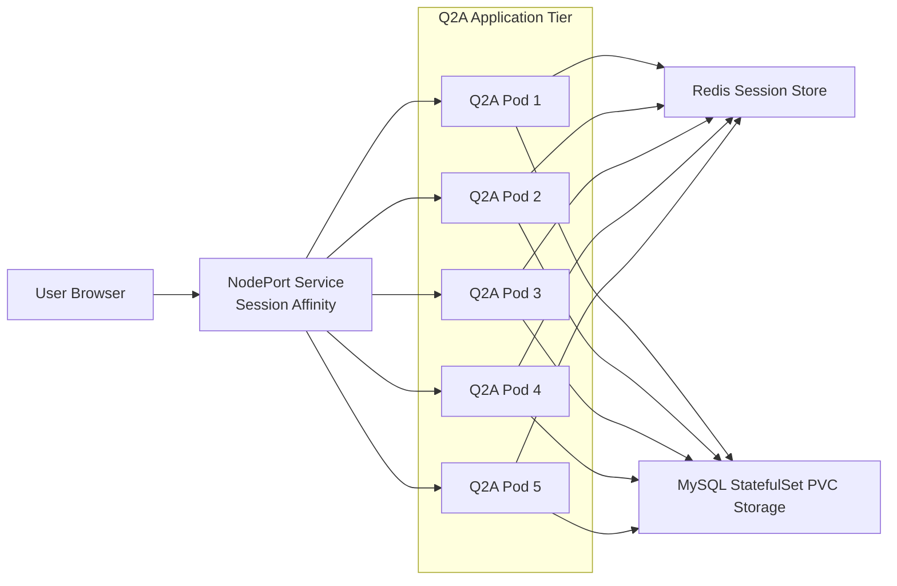

## Components
<p align="center">
  
</p>

<h1 align="center">
Cloud-Native Three-Tier Web Application Deployment on K3s
</h1>

<p align="center">
Kubernetes • K3s • Docker • Redis • MySQL • Vagrant • VirtualBox
</p>


A cloud-native deployment of the Question2Answer (Q2A) platform running on a multi-node K3s Kubernetes cluster provisioned with Vagrant and VirtualBox.

This project demonstrates infrastructure automation, containerization, Kubernetes orchestration, persistent storage management, distributed session handling, and scalable application deployment within a locally hosted Kubernetes environment.

---

# Table of Contents

- [Overview](#overview)
- [Architecture](#architecture)
  - [Network Topology](#network-topology)
  - [Component Interactions](#component-interactions)
- [Technology Stack](#technology-stack)
- [Key Features](#key-features)
- [Deployment](#deployment)
- [Repository Structure](#repository-structure)
- [Future Improvements](#future-improvements)

---

## Overview

The application follows a classic three-tier architecture:

- Presentation Layer – Question2Answer PHP/Apache application
- Application & Session Layer – Redis session store
- Data Layer – MySQL database with persistent storage

---

## Architecture

### Network Topology



### Component Interactions



## Technology Stack

| Component | Technology |
|------------|------------|
| Container Runtime | Docker |
| Orchestration | K3s Kubernetes |
| Provisioning | Vagrant |
| Virtualization | VirtualBox |
| Application | Question2Answer |
| Web Server | Apache |
| Language | PHP 8.1 |
| Database | MySQL |
| Session Store | Redis |
| Operating System | Ubuntu 22.04 |

## Key Features

- Multi-node K3s cluster
- 5-replica Q2A deployment
- Redis-backed distributed sessions
- MySQL StatefulSet with persistent storage
- Infrastructure as Code with Vagrant
- Custom Docker image build
- Session affinity load balancing

## Deployment

```bash
vagrant up
kubectl apply -f kubernetes.yaml
kubectl get pods
kubectl get services
```

Access:

```text
http://<NODE-IP>:30080
```

## Repository Structure

```text
.
├── Vagrantfile
├── kubernetes.yaml
├── Dockerfile
├── entrypoint.sh
├── scripts/
│   ├── setup-server.sh
│   └── setup-agent.sh
└── fix-host-network.sh
```

## Future Improvements

- Ingress Controller
- TLS with cert-manager
- Horizontal Pod Autoscaler
- Monitoring with Prometheus and Grafana
- MySQL replication
- GitHub Actions CI/CD
