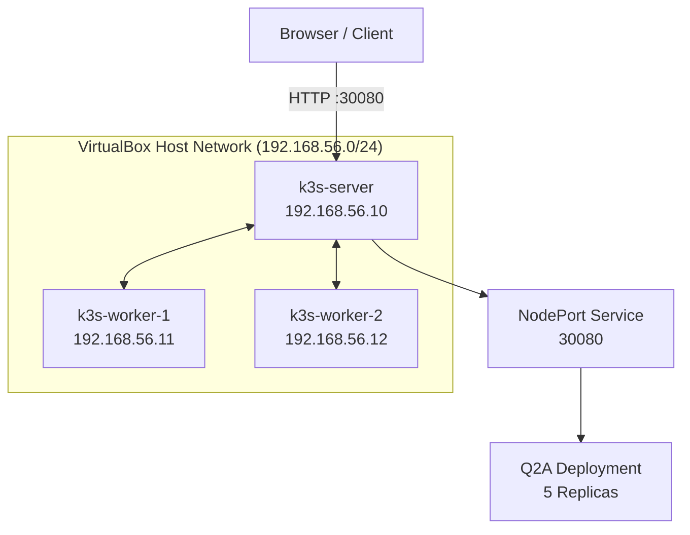
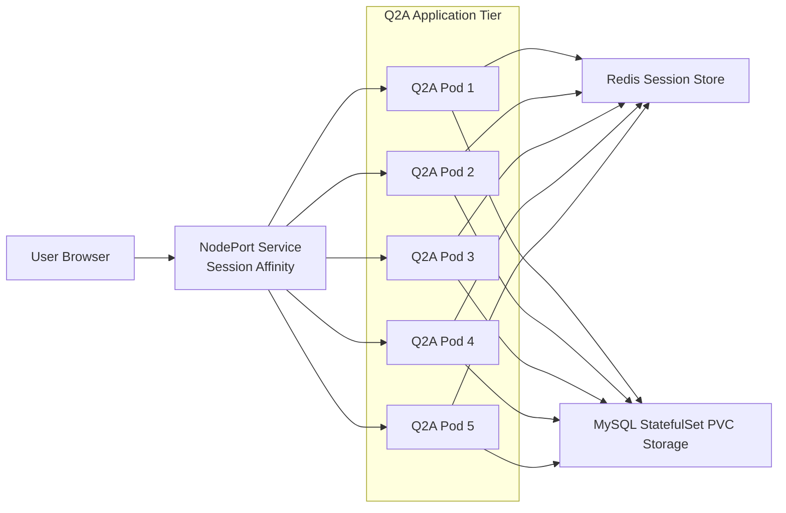

## Components
<p align="center">
  
</p>
Cloud-Native Three-Tier Web Application Deployment on K3s
</h1>

<p align="center">
<h1 align="center">

Kubernetes • K3s • Docker • Redis • MySQL • Vagrant • VirtualBox
</p>


<h4>
A cloud-native deployment of the Question2Answer (Q2A) platform running on a multi-node K3s Kubernetes cluster provisioned with Vagrant and VirtualBox.</h4>

This project demonstrates infrastructure automation, containerization, Kubernetes orchestration, persistent storage management, distributed session handling, and scalable application deployment within a locally hosted Kubernetes environment.

---

# Table of Contents

- [Overview](#overview)
- [Architecture](#architecture)
  - [Network Topology](#network-topology)
  - [Component Interactions](#component-interactions)
- [Technology Stack](#technology-stack)
- [Key Features](#key-features)
- [Deployment](#deployment)
- [Repository Structure](#repository-structure)
- [Issues solved](#the-multi-node-network-isolation-challenge-the-host-fix-script)
- [Lighter Version for WSL2 in Windows](./light-wsl2-kvm/README-SMALL-LAB#-getting-started)
- [Future Improvements](#future-improvements)

---

## Overview

The application follows a classic three-tier architecture:

- Presentation Layer – Question2Answer PHP/Apache application
- Application & Session Layer – Redis session store
- Data Layer – MySQL database with persistent storage

---

## Architecture

### Network Topology



### Component Interactions



## Technology Stack

| Component | Technology |
|------------|------------|
| Container Runtime | Docker |
| Orchestration | K3s Kubernetes |
| Provisioning | Vagrant |
| Virtualization | VirtualBox |
| Application | Question2Answer |
| Web Server | Apache |
| Language | PHP 8.1 |
| Database | MySQL |
| Session Store | Redis |
| Operating System | Ubuntu 22.04 |

## Key Features

- Multi-node K3s cluster
- 5-replica Q2A deployment
- Redis-backed distributed sessions
- MySQL StatefulSet with persistent storage
- Infrastructure as Code with Vagrant
- Custom Docker image build
- Session affinity load balancing

## Deployment

```bash
vagrant up
kubectl apply -f kubernetes.yaml
kubectl get pods
kubectl get services
```

Access:

```text
http://<NODE-IP>:30080
```

## Repository Structure

```text
.
├── Vagrantfile
├── kubernetes.yaml
├── Dockerfile
├── entrypoint.sh
├── scripts/
│   ├── setup-server.sh
│   └── setup-agent.sh
└── fix-host-network.sh
```


---

## The Multi-Node Network Isolation Challenge (The Host Fix Script)

### The Issue
When setting up a multi-node Kubernetes cluster via Vagrant using VirtualBox's default Private Host-Only networking (`vboxnet`), a standard operating system routing conflict can isolate the cluster agents. The host OS or virtualization bridge often defaults to processing traffic through your primary home network gateway rather than keeping node-to-node packets inside the isolated private subnet. This breaks Flannel VXLAN pod routing, leaving worker nodes unable to communicate or join the master node correctly.

### The Automated Solution (`fix-host-network.sh`)
To resolve this without manual hypervisor point-and-click intervention, this repository utilizes an automated network orchestration script. The script identifies the host's virtual adapter boundaries, flushes stale local routing entries, and rebuilds the private virtual network bridge with explicit metrics. This guarantees seamless node-to-node telemetry.

### Configuration Template
Since environment-specific parameters (such as physical interface names) are ignored by Git for security, copy the tracked template to replicate this fix in your local lab environment:

```bash
cp fix-host-network.sh.example fix-host-network.sh
chmod +x fix-host-network.sh
```
```bash
#!/usr/bin/env bash
# =========================================================================
# Host Network Resolution Script (Sanitized Template)
# Fixes routing conflicts between the Host OS and VirtualBox Host-Only interfaces
# =========================================================================

set -euo pipefail

# --- Environment Configurations (Modify to match your local setup) ---
VBOX_INTERFACE="vboxnet0"
TARGET_SUBNET="192.168.XX.0/24"  # ◄── Replace with your private cluster subnet
GATEWAY_IP="192.168.XX.1"       # ◄── Replace with your host bridge interface gateway IP

echo "[*] Auditing local virtualization network routing entries..."

# 1. Clear conflicting interfaces or stale IP assignments
if ip link show "$VBOX_INTERFACE" >/dev/null 2>&1; then
    echo "[!] Found active interface $VBOX_INTERFACE. Flushing stale routing tables..."
    sudo ip addr flush dev "$VBOX_INTERFACE"
    sudo ip link set "$VBOX_INTERFACE" down
fi

# 2. Re-initialize physical virtual adapter state
echo "[*] Re-enabling $VBOX_INTERFACE interface..."
sudo ip link set "$VBOX_INTERFACE" up
sudo ip addr add "$GATEWAY_IP/24" dev "$VBOX_INTERFACE"

# 3. Force precise subnet isolation routes
echo "[*] Enforcing isolated route metrics for cluster subnet..."
sudo ip route replace "$TARGET_SUBNET" dev "$VBOX_INTERFACE" proto kernel scope link src "$GATEWAY_IP" metric 10

echo "[🎉] Host network isolation resolved. Run 'vagrant up' to provision the cluster."
```

## Future Improvements

- Ingress Controller
- TLS with cert-manager
- Horizontal Pod Autoscaler
- Monitoring with Prometheus and Grafana
- MySQL replication
- GitHub Actions CI/CD
